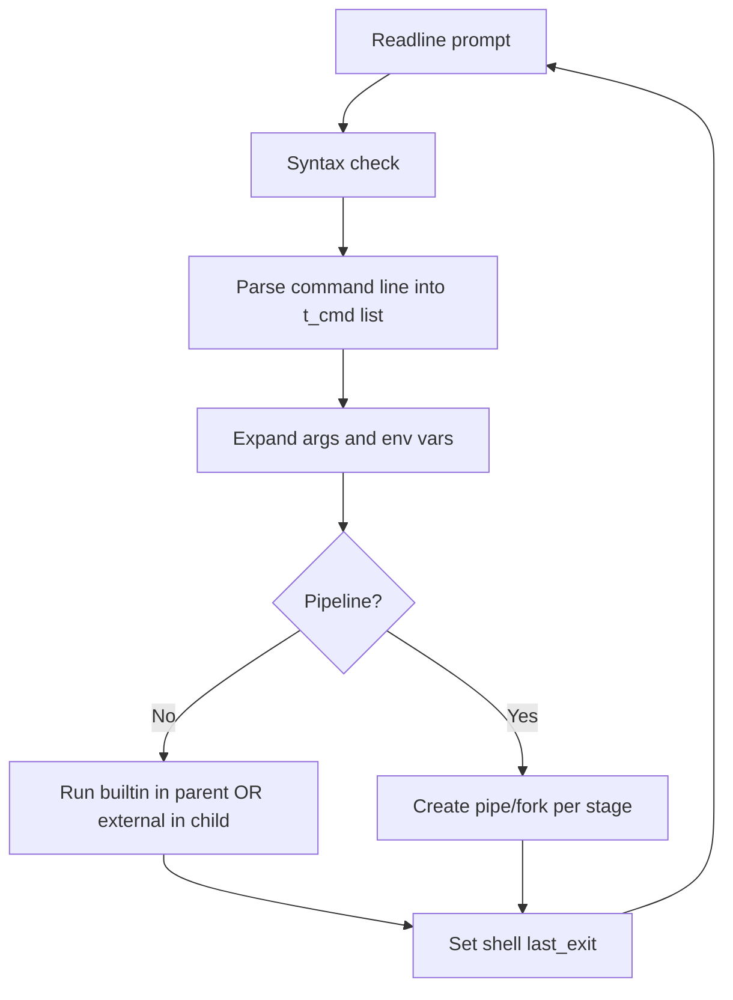

# Minishell Study Guide

This guide is meant for fast revision before evaluation.
It explains how a minishell usually works, how this project is structured, and what examiners often ask.

## 1) What Minishell Is

A minishell is a small Bash-like interpreter.
At a high level, every loop does this:

1. Show prompt and read a line.
2. Validate syntax.
3. Parse into commands and redirections.
4. Expand variables and special values.
5. Execute builtins or external commands.
6. Collect exit status and repeat.

Core goals:
- Correct behavior for pipes and redirections.
- Correct exit codes.
- Signal handling similar to Bash.
- Clean memory and no crashes.

## 2) Big Picture Flow

## 3) Your Project Structure (Mental Map)

- `main.c`, `signals.c`: startup, environment copy, signal setup, loop entry.
- `prompt.c`, `prompt_utils.c`: readline loop, splitting command sequences.
- `parser/`: tokenization, syntax checks, redirections, command list construction.
- `executor/`: expansion, builtin/external execution, pipeline orchestration, error mapping.
- `redirections/`: open/dup2 logic for `<`, `>`, `>>`, `<<`.
- `builtins/`: `echo`, `cd`, `pwd`, `export`, `unset`, `exit`.
- `env/`: environment table helpers.

## 4) Core Data Structures You Should Explain

### `t_shell`
Represents global shell state:
- environment (`env`)
- last command exit code (`last_exit`)
- termination flag (`should_exit`)
- parser status (`parser_status`)

### `t_cmd`
Represents one command node in a pipeline:
- `args` array
- redirection list (`redirs`)
- legacy fields (`infile`, `outfile`, etc.)
- `next` pointer for pipeline chain

### `t_redir`
Represents one redirection operation:
- type: input, output truncate, append, heredoc
- target file or delimiter
- linked-list chaining

## 5) Parsing and Syntax Basics

A strong parsing story during evaluation:

1. First pass validates syntax:
- unmatched quotes
- invalid pipe positions
- malformed redirections

2. Second pass builds command nodes:
- split by unquoted pipes
- parse words while respecting quotes
- parse and attach redirections in order

3. Parser status is written into shell state:
- avoids relying on many globals
- keeps behavior predictable across modules

## 6) Expansion Rules (Typical)

Important rules to remember:
- `$VAR` expands to environment value or empty if missing.
- `$?` expands to previous exit code.
- Expansion depends on quote context:
  - single quotes: no expansion
  - double quotes: expansion allowed
- Expansion happens before execution.

If expansion yields empty tokens, argument rebuilding must still remain valid and memory-safe.

## 7) Execution Model

### Single command
- If builtin that must affect shell state (`cd`, `export`, `unset`, `exit`), run in parent process.
- If the command has no argv left but still has redirections, apply the redirections anyway so standalone `<<EOF` or `>file` behaves like a real shell command.
- Other commands can run via child + `execve`.

### Pipeline
For each command stage:
1. Create pipe if there is a next stage.
2. Fork.
3. In child:
- wire stdin/stdout with `dup2`
- apply command redirections
- run builtin or `execve`
4. In parent:
- close unused FDs
- continue next stage
5. Wait all children and keep status from last pipeline command.

### Redirection precedence with pipes
- Pipe sets default stdin/stdout between stages.
- Command redirections override those defaults for that stage.

Example:
- `echo hi >file | echo bye`
  - first command writes to `file` (not to pipe)
  - second command prints `bye`

## 8) Exit Codes You Should Memorize

- `0`: success
- `1`: generic error
- `2`: shell misuse / syntax-like errors (context dependent)
- `126`: found but not executable (permission denied, directory as command path)
- `127`: command not found
- `128 + signal`: process terminated by signal

Key distinction:
- bare name not found in PATH -> `127`
- explicit path like `./script` with no exec bit -> `126`

## 9) Signal Behavior (Typical Expected)

Interactive shell:
- `Ctrl-C` should interrupt current line and show a fresh prompt.
- `Ctrl-\` should usually be ignored in prompt mode.
- While the parent is waiting on an external command or pipeline, it should ignore `SIGINT`/`SIGQUIT` so nested shells do not print duplicate prompts.

Child process mode:
- reset signals to default before `execve`.
- then signals behave like normal Unix command execution.

## 10) Memory and FD Hygiene Checklist

Before evaluation, verify:
- all allocated arrays and linked lists are freed on each loop.
- no double-free on parser/executor error paths.
- every `open`/`pipe`/`dup` fd is closed on all branches.
- heredoc temp resources are cleaned.
- reachable readline allocations are understood (or suppressed correctly only if allowed in your workflow).

## 11) Common Failure Patterns

- Applying redirections in wrong order relative to pipeline wiring.
- Wrong exit code mapping (`126` vs `127`).
- Parent process accidentally modified by child-only logic.
- Builtin executed in child when it should update parent state.
- Missing `errno` semantics when handling `execve` failure.
- Quote handling bugs that break token boundaries.

## 12) Evaluation Revision Script

Use this quick self-check:

1. Explain parser flow from raw line to linked command list.
2. Explain exactly where expansion happens.
3. Explain single command builtin vs pipeline builtin behavior.
4. Explain how last exit code is chosen in pipeline.
5. Explain 126 vs 127 with concrete examples.
6. Explain signal policy in parent vs child.
7. Explain one redirection + pipe edge case accurately.
8. Explain memory ownership for `args`, `redirs`, and command list.

If you can answer all 8 cleanly, you are in strong shape.

---

# FAQ (With Answers)

## Q1) Why do some builtins run in parent and some in child?
Because state-changing builtins must affect the shell process itself. If `cd` runs in a child, parent working directory does not change.

## Q2) Why does `export` in a pipeline often not persist?
Each pipeline stage runs in a child process context. Changes in child environment do not propagate back to parent shell.

## Q3) Why is `command not found` code 127 and not 126?
`127` means the command cannot be resolved/executed by name lookup. `126` means target exists but cannot be executed.

## Q4) Why can redirection override pipe input/output?
Pipe provides default FDs for the stage, but command-specific redirections are explicit overrides for that command.

## Q5) Why do we keep status from the last command in pipeline?
That matches shell behavior: pipeline exit status follows the rightmost command (unless special options like pipefail are implemented, which minishell usually does not require).

## Q6) What is the safest `exec` strategy for minishell?
Use `execve` with manual PATH resolution and explicit error mapping.

## Q7) Why is quote handling hard?
Because quotes affect token splitting and expansion rules simultaneously. You must preserve token boundaries while tracking whether expansion is allowed.

## Q8) What does a good parser error path look like?
Immediate error message, parser status update, and full cleanup of partial structures without leaking memory.

## Q9) How should I debug wrong output in pipelines?
Check in this order:
1. command list built correctly?
2. redirection list attached correctly per command?
3. child fd wiring order (`dup2`) correct?
4. redirections applied after intended defaults?
5. parent closes correct pipe ends?

## Q10) What questions do evaluators commonly ask?
- "Show me where you decide builtin vs external."
- "Show me where exit code is set after waitpid."
- "Show me how you handle `$?`."
- "Show me how you prevent fd leaks in pipelines."
- "Explain one tricky bug you fixed and why."

## Q11) How can I present confidently in evaluation?
Use cause-and-effect explanations:
- "Input line enters parser."
- "Parser creates `t_cmd` chain."
- "Executor expands args."
- "For each stage, pipe/fork/dup2/redir/exec."
- "Parent waits and stores last exit code."

Short, precise, and consistent beats long and vague.

## Q12) Last-minute prep in 20 minutes?
- 5 min: re-read parser and executor entry functions.
- 5 min: re-check exit code mapping and signals.
- 5 min: run a few redirection + pipeline edge tests.
- 5 min: explain architecture aloud without reading code.

Good luck. You already solved the hard parts by fixing behavior and edge cases; this guide is for polishing explanation quality under pressure.
